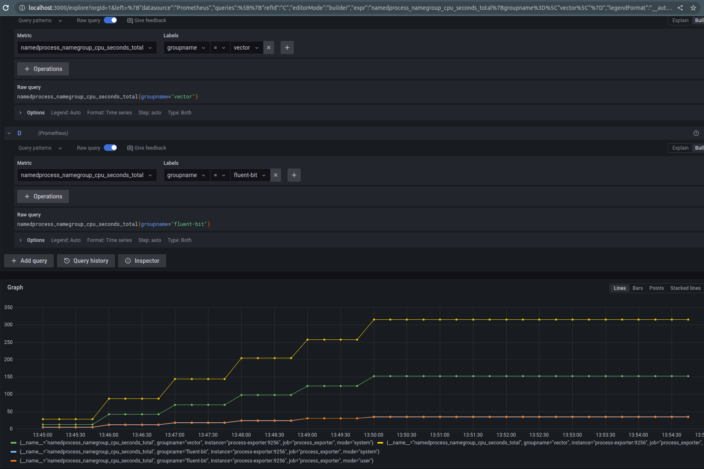

# Vendor comparison VM image

VM images are created for AWS and GCP with the following components included:

- Logstash
- Vector
- Calyptia Fluent Bit LTS
- OSS Fluent Bit

For each tool we install them but do not enable them, i.e. they do not run on boot.

In addition we clone <https://github.com/calyptia/fluent-bit-devtools> and <https://github.com/fluent/fluent-bit-ci> so we can also reuse the monitoring stack provided there.

We then provide some additional configuration for this:

- [Prometheus monitoring endpoints](./config/monitoring/prometheus/prometheus.yml)
- [Loki forwarding of all the logs](./config/monitoring/fluent-bit.conf)
- [Process-exporter](https://github.com/ncabatoff/process-exporter) for non-container monitoring.
- [HTTPS server to receive data](https://github.com/calyptia/https-benchmark-server).

We provide a [simple test framework](./config/test/run-test.sh) to exercise everything although you can do it manually or in some other fashion.

The [Calyptia configuration](https://github.com/calyptia/bats) of the [Bash Automated Test System (BATS)](https://bats-core.readthedocs.io/en/stable/) is also provided.

## Usage

Essentially the approach is as follows:

1. Create a VM from the image.
2. Configure all the tools to do what you want from an evaluation perspective.
3. Run the tools for a configurable amount of time.
4. Capture metrics and analyse them.

All this can be wrapped up in a script like the [test example](./run-gcp-test.sh).
It can also be done in any other fashion you want, including manually.

### Example

Run the Google Compute test script after setting up `gcloud` access locally with the right project, etc.

```bash
./run-gcp-test.sh
...
```

This will run for a few minutes then provide a local `output` directory with all the metrics in it including the Prometheus snapshot.
To load the Prometheus snapshot, follow the instructions here: <https://github.com/fluent/fluent-bit-ci/tree/main/helpers/prometheus-snapshot-loader>

```shell
$ export PROMETHEUS_DATA=$PWD/output/prom-data.tgz
$ ~/github/fluent/fluent-bit-ci/helpers/prometheus-snapshot-loader/run.sh
Extracting tarball: /tmp/output/prom-data.tgz --> /tmp/tmp.2ao8T5scjj
Data directory extracted: /tmp/tmp.2ao8T5scjj/20220805T101627Z-168a7d7455a9dfeb
Found snapshot directory: /tmp/tmp.2ao8T5scjj/20220805T101627Z-168a7d7455a9dfeb
Creating prometheus-snapshot-loader_prometheus_1 ... done
Creating prometheus-snapshot-loader_grafana_1    ... done
```

Grafana is now available on `https://localhost:3000` and Prometheus on `https://localhost:9090`.

For example we can query the CPU usage:

- namedprocess_namegroup_cpu_seconds_total{groupname="fluent-bit"}
- namedprocess_namegroup_cpu_seconds_total{groupname="vector"}



To stop running the stack, just kill the containers:

```shell
$ docker ps
CONTAINER ID   IMAGE                     COMMAND                  CREATED          STATUS          PORTS                                       NAMES
bb699bd1b6c4   grafana/grafana           "/run.sh"                23 minutes ago   Up 23 minutes   0.0.0.0:3000->3000/tcp, :::3000->3000/tcp   prometheus-snapshot-loader_grafana_1
2dacdb667cbd   prom/prometheus:v2.33.3   "/bin/prometheus --c…"   23 minutes ago   Up 23 minutes   0.0.0.0:9090->9090/tcp, :::9090->9090/tcp   prometheus-snapshot-loader_prometheus_1
$ docker rm -f prometheus-snapshot-loader_grafana_1 prometheus-snapshot-loader_prometheus_1
prometheus-snapshot-loader_grafana_1
prometheus-snapshot-loader_prometheus_1
```

## Test Framework

See the [detailed documentation here](./test/README.md).
